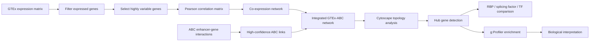

# Integrative Multi-Omics Regulatory Network Analysis using GTEx Co-expression and ABC Enhancer-Gene Interactions


---

## Overview

This project integrates GTEx transcriptomic co-expression data with ABC enhancer-gene interaction maps to identify regulatory hubs in a multi-omics gene regulatory network. The analysis combines expression-based network structure, enhancer-gene regulatory links, Cytoscape topology metrics, hub gene annotation, and functional enrichment interpretation.

**Main conclusion:** the integrated GTEx-ABC network is strongly organized around RNA-binding proteins, spliceosomal regulators, mRNA processing factors, and post-transcriptional regulatory mechanisms.

---

## Biological Motivation

Gene regulation is shaped by both transcriptional coordination and enhancer-mediated control. GTEx co-expression captures genes that vary together across transcriptomic samples, while ABC enhancer-gene maps identify candidate regulatory links between enhancers and target genes. Integrating these layers helps reveal genes that are central not only by expression similarity, but also by regulatory network architecture.

---

## Workflow



---

## Three-Script Analysis Workflow

| Script | Purpose |
| --- | --- |
| `scripts/01_build_gtex_coexpression_network.R` | Loads GTEx expression data, filters genes, selects highly variable genes, computes Pearson correlations, and exports the co-expression edge list. |
| `scripts/02_integrate_abc_and_export_network.R` | Maps Ensembl IDs to gene symbols, filters ABC enhancer-gene links, integrates ABC targets with the co-expression network, and exports Cytoscape-ready network files. |
| `scripts/03_analyze_hubs_enrichment_and_plots.R` | Summarizes hub genes, regulatory-class overlaps, enrichment findings, and publication-style hub gene plots. |

This compact workflow replaces the earlier step-by-step script layout and gives the repository a cleaner, more professional research-pipeline structure.

---

## Methods

### GTEx Co-expression Network

GTEx expression profiles were filtered to retain genes expressed above a TPM threshold in a sufficient fraction of samples. Highly variable genes were selected, log-transformed, and used to compute a Pearson correlation matrix. Strong gene-gene correlations were retained as co-expression network edges.

### ABC Enhancer-Gene Integration

ABC enhancer-gene interactions were filtered for high-confidence links and mapped to genes present in the co-expression network. This produced an integrated regulatory network connecting transcriptomic co-expression structure with enhancer-gene regulatory evidence.

### Network Topology and Hub Detection

Network files were exported for Cytoscape. Topological metrics including degree, betweenness centrality, closeness centrality, and clustering coefficient were used to prioritize hub genes.

### Functional Enrichment

Hub-associated genes were interpreted using g:Profiler enrichment results, with emphasis on RNA splicing, mRNA processing, KEGG spliceosome enrichment, RNA-binding proteins, and post-transcriptional regulation.

---

## Results

### Top Hub Genes

| Rank | Gene | Degree | Interpretation |
| ---: | --- | ---: | --- |
| 1 | `NONO` | 265 | RNA-binding protein; splicing and RNA processing regulator |
| 2 | `HNRNPK` | 192 | Heterogeneous nuclear ribonucleoprotein |
| 3 | `HNRNPD` | 212 | RNA-binding protein involved in mRNA stability |
| 4 | `DHX9` | 203 | RNA helicase linked to RNA processing |
| 5 | `PRPF8` | 189 | Core spliceosome component |
| 6 | `TRA2B` | 201 | Alternative splicing factor |
| 7 | `KHDRBS1` | 190 | RNA-binding and splicing-associated regulator |
| 8 | `SNRNP200` | 203 | Spliceosome RNA helicase |
| 9 | `ACIN1` | 196 | RNA splicing-associated protein |
| 10 | `SNW1` | 208 | Splicing and transcriptional co-regulatory factor |

Tracked result tables:

- [Top hub genes](results/tables/top_hub_genes.csv)
- [Regulatory overlap summary](results/tables/regulatory_overlap_summary.csv)
- [Network topology metrics](results/networks/cytoscape_networks_genes.csv)
- [Functional enrichment summary](results/enrichment/gprofiler_key_findings.tsv)

### Functional Enrichment Findings

| Enrichment Signal | Interpretation |
| --- | --- |
| RNA splicing | Central hubs converge on pre-mRNA splicing and transcript maturation. |
| mRNA processing | The network is organized around genes involved in mature RNA production. |
| KEGG spliceosome | Spliceosome machinery is a major pathway-level signal. |
| RNA-binding proteins | Topological hubs are enriched for RNA-binding and ribonucleoprotein-associated genes. |
| Post-transcriptional regulation | Enhancer-linked co-expression architecture highlights RNA-level regulation. |

### Figure Placeholders

```markdown


```

---

## Biological Interpretation

The integrated GTEx-ABC regulatory network is enriched for RNA-binding proteins and spliceosomal regulators rather than generic high-degree genes. Hub genes such as `NONO`, `HNRNPK`, `HNRNPD`, `DHX9`, `PRPF8`, `TRA2B`, `KHDRBS1`, `SNRNP200`, `ACIN1`, and `SNW1` support a model in which enhancer-linked co-expression architecture converges on RNA maturation, spliceosome function, and post-transcriptional regulation.

---

## Repository Structure

```text
.
|-- README.md
|-- CITATION.cff
|-- LICENSE
|-- config/
|-- data/
|   |-- raw/
|   |-- processed/
|   |-- external/
|   |-- network_edges/
|   `-- enrichment_outputs/
|-- docs/
|-- figures/
|   |-- network/
|   |-- enrichment/
|   `-- hub_genes/
|-- results/
|   |-- networks/
|   |-- enrichment/
|   `-- tables/
|-- scripts/
|   |-- 01_build_gtex_coexpression_network.R
|   |-- 02_integrate_abc_and_export_network.R
|   `-- 03_analyze_hubs_enrichment_and_plots.R
`-- archive/
    `-- legacy_scripts/
```

---

## Technologies Used

| Category | Tools |
| --- | --- |
| Programming | R, data.table, ggplot2 |
| Transcriptomics | GTEx expression data |
| Regulatory genomics | ABC enhancer-gene interactions |
| Network analysis | Pearson correlation, Cytoscape topology metrics |
| Functional enrichment | g:Profiler |
| Visualization | Cytoscape, hub gene plots, enrichment plots |

---

## Future Directions

- Add `renv.lock` for exact R package reproducibility.
- Add a small demo dataset for reproducible public execution.
- Add Cytoscape session files and visual style legends.
- Quantify statistical overlap for RBPs, splicing factors, and transcription factors.
- Add community detection to identify regulatory modules.
- Compare hub genes with disease-associated gene sets or GWAS catalogs.
- Package the workflow as a Snakemake or Nextflow pipeline.

---

## References

- GTEx Consortium. The GTEx Consortium atlas of genetic regulatory effects across human tissues. *Science*.
- Fulco CP et al. Activity-by-contact model of enhancer-promoter regulation from thousands of CRISPR perturbations. *Nature Genetics*.
- Shannon P et al. Cytoscape: a software environment for integrated models of biomolecular interaction networks. *Genome Research*.
- Raudvere U et al. g:Profiler: a web server for functional enrichment analysis and conversions of gene lists. *Nucleic Acids Research*.
- Gerstberger S, Hafner M, Tuschl T. A census of human RNA-binding proteins. *Nature Reviews Genetics*.

---

## GitHub Repository Metadata

**Concise repository description:**

> Integrative GTEx co-expression and ABC enhancer-gene network analysis identifying RNA-binding and spliceosomal hub regulators.

**Recommended topics/tags:**

`bioinformatics`, `computational-biology`, `multi-omics`, `gtex`, `abc-model`, `enhancer-gene-interactions`, `gene-regulatory-networks`, `coexpression-network`, `network-biology`, `cytoscape`, `gprofiler`, `functional-enrichment`, `rna-binding-proteins`, `spliceosome`, `post-transcriptional-regulation`, `systems-biology`, `rstats`

---

## LinkedIn-Ready Summary

I developed an integrative multi-omics regulatory network analysis combining GTEx gene co-expression data with ABC enhancer-gene interaction maps to identify biologically meaningful regulatory hubs. After filtering highly variable genes, constructing a Pearson correlation-based co-expression network, integrating enhancer-gene links, and analyzing network topology in Cytoscape, the project identified central hub genes including `NONO`, `HNRNPK`, `HNRNPD`, `DHX9`, `PRPF8`, `TRA2B`, `KHDRBS1`, `SNRNP200`, `ACIN1`, and `SNW1`. Functional enrichment with g:Profiler revealed strong enrichment for RNA splicing, mRNA processing, KEGG spliceosome pathways, RNA-binding proteins, and post-transcriptional regulation, suggesting that the integrated GTEx-ABC network is organized around RNA regulatory mechanisms.
