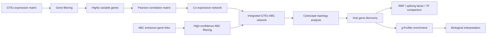
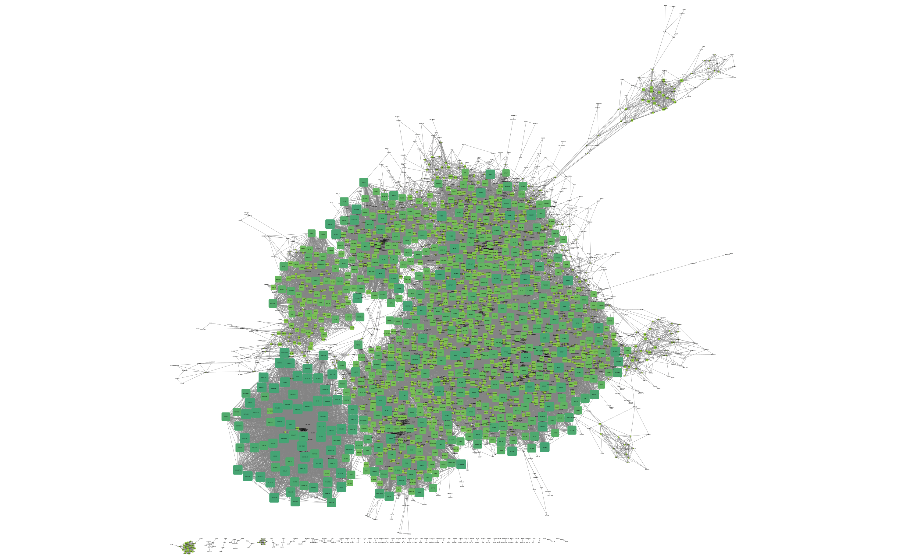
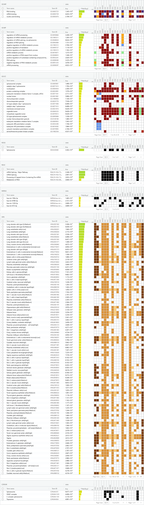

# Integrative Multi-Omics Regulatory Network Analysis using GTEx Co-expression and ABC Enhancer-Gene Interactions


---

## Overview

This project builds an integrative regulatory network by combining GTEx transcriptomic co-expression patterns with ABC enhancer-gene interaction data. The goal is to identify highly connected genes and regulatory modules that link gene expression structure to putative enhancer-mediated regulation.

The analysis integrates GTEx-derived gene expression profiles, highly variable gene selection, Pearson correlation-based co-expression network construction, ABC enhancer-gene interaction filtering and integration, Cytoscape-based network topology analysis, hub gene detection, functional enrichment analysis with g:Profiler, and comparison of hub genes against RNA-binding proteins, splicing factors, and transcription factors.

**Main conclusion:** the integrated GTEx-ABC regulatory network is strongly organized around RNA-binding proteins, spliceosomal regulators, and post-transcriptional regulatory mechanisms.

---

## Biological Motivation

Gene regulatory programs are shaped by both transcriptional coordination and enhancer-mediated regulation. GTEx co-expression captures genes that vary together across transcriptomic samples, while ABC enhancer-gene maps provide candidate regulatory links between noncoding regulatory elements and target genes.

By integrating these two layers, this project asks a systems-level question: **which genes become central when expression similarity and enhancer-linked regulation are considered together?** The resulting network highlights regulatory hubs that may coordinate broad RNA-processing programs across the transcriptome.

---

## Workflow Diagram



---

## Methods

### 1. GTEx Expression Processing

GTEx transcriptomic data were loaded and filtered to remove genes with low or uninformative expression. This reduced technical noise and focused downstream analysis on genes with meaningful expression variation across samples.

### 2. Highly Variable Gene Selection

Highly variable genes were prioritized to capture the most informative expression signals. This improves network interpretability by focusing the correlation analysis on genes with stronger biological variability.

### 3. Co-expression Network Construction

A Pearson correlation matrix was computed across selected genes. Strong gene-gene correlations were retained as network edges, producing a co-expression graph where nodes represent genes and edges represent coordinated expression patterns.

### 4. ABC Enhancer-Gene Integration

Activity-by-Contact enhancer-gene links were filtered for high-confidence interactions and mapped onto genes present in the co-expression network. This added a regulatory genomics layer to the transcriptomic network.

### 5. Cytoscape Network Topology Analysis

The integrated network was exported for Cytoscape analysis. Network topology metrics were used to identify highly connected genes and prioritize candidate regulatory hubs.

### 6. Functional Enrichment Analysis

Hub genes and network-associated gene sets were analyzed with g:Profiler to identify enriched Gene Ontology terms, pathways, and biological processes.

### 7. Regulatory Class Comparison

Top hub genes were compared against known RNA-binding proteins, splicing factors, and transcription factors to determine whether specific regulatory classes were overrepresented among central network nodes.

---

## Results

### Integrated Network Architecture

The GTEx co-expression network, after integration with ABC enhancer-gene interactions, revealed a regulatory structure enriched for genes involved in RNA processing and post-transcriptional regulation.

```markdown

```

### Top Hub Genes

| Rank | Gene | Degree | Interpretation |
| ---: | --- | ---: | --- |
| 1 | `NONO` | 265 | RNA-binding protein; splicing and RNA processing regulator |
| 2 | `HNRNPK` | 192 | Heterogeneous nuclear ribonucleoprotein |
| 3 | `HNRNPD` | 212 | RNA-binding protein involved in mRNA stability |
| 4 | `DHX9` | 203 | RNA helicase linked to RNA processing |
| 5 | `PRPF8` | 189 | Core spliceosome component |
| 6 | `TRA2B` | 201 | Alternative splicing factor |
| 7 | `KHDRBS1` | 190 | RNA-binding and splicing-associated regulator |
| 8 | `SNRNP200` | 203 | Spliceosome RNA helicase |
| 9 | `ACIN1` | 196 | RNA splicing-associated protein |
| 10 | `SNW1` | 208 | Splicing and transcriptional co-regulatory factor |

Figure placeholders:

```markdown


```

Tracked result tables:

- [Top hub genes](results/tables/top_hub_genes.csv)
- [Regulatory overlap summary](results/tables/regulatory_overlap_summary.csv)
- [Network topology metrics](results/networks/cytoscape_networks_genes.csv)

### Functional Enrichment Findings

Functional enrichment analysis showed strong enrichment for RNA-centric regulatory processes, including RNA splicing, mRNA processing, spliceosome-associated pathways, RNA-binding proteins, and post-transcriptional regulation.

| Enrichment Signal | Interpretation |
| --- | --- |
| RNA splicing | Central hubs converge on pre-mRNA splicing and transcript maturation. |
| mRNA processing | The network is organized around genes involved in mature RNA production. |
| KEGG spliceosome | Spliceosome machinery is a major pathway-level signal. |
| RNA-binding proteins | Topological hubs are enriched for RNA-binding and ribonucleoprotein-associated genes. |
| Post-transcriptional regulation | Enhancer-linked co-expression architecture highlights RNA-level regulation. |

```markdown



```

Curated enrichment summary: [results/enrichment/gprofiler_key_findings.tsv](results/enrichment/gprofiler_key_findings.tsv)

---

## RBP and Spliceosome Interpretation

The central genes in the integrated GTEx-ABC network are not random high-degree nodes. They are concentrated among RNA-binding proteins and spliceosomal regulators, suggesting that post-transcriptional regulation is a major organizing axis of the network.

Several hub genes, including `NONO`, `HNRNPK`, `HNRNPD`, `DHX9`, and `PRPF8`, have well-established roles in RNA metabolism, splicing, transcript stability, and ribonucleoprotein complex function. The enrichment of spliceosome and mRNA processing pathways supports a model in which enhancer-linked regulatory architecture converges on genes involved in RNA maturation and post-transcriptional control.

Overall, this analysis suggests that integrating enhancer-gene interaction maps with co-expression topology can reveal regulatory hubs that are not only highly connected, but also biologically coherent.

---

## Technologies Used

| Category | Tools |
| --- | --- |
| Programming | R, data.table, ggplot2 |
| Transcriptomics | GTEx expression data |
| Regulatory genomics | ABC enhancer-gene interactions |
| Network analysis | Pearson correlation, graph edge filtering, Cytoscape |
| Functional enrichment | g:Profiler |
| Visualization | Cytoscape, hub gene plots, enrichment plots |
| Reproducibility | Ordered scripts, structured results directories, GitHub documentation |

---

## Repository Structure

```text
.
|-- README.md
|-- CITATION.cff
|-- LICENSE
|-- config/
|-- data/
|   |-- raw/
|   |-- processed/
|   |-- external/
|   |-- network_edges/
|   `-- enrichment_outputs/
|-- docs/
|-- figures/
|   |-- network/
|   |-- enrichment/
|   `-- hub_genes/
|-- notebooks/
|-- references/
|-- results/
|   |-- networks/
|   |-- enrichment/
|   `-- tables/
`-- scripts/
```

---

## Script Guide

| Script | Purpose |
| --- | --- |
| `01_load_expression.R` | Load GTEx expression data for downstream processing. |
| `02_filter_genes.R` | Remove low-quality or uninformative genes. |
| `03_select_variable_genes.R` | Select highly variable genes for network construction. |
| `04_coexpression_network.R` | Compute gene-gene Pearson correlations. |
| `05_build_network.R` | Build a thresholded co-expression edge list. |
| `06_clean_gene_ids.R` | Clean and standardize gene identifiers. |
| `07_filter_abc_links.R` | Filter ABC enhancer-gene interactions. |
| `08_gene_id_conversion.R` | Convert gene identifiers for compatibility across datasets. |
| `09_convert_network_symbols.R` | Map network gene IDs to gene symbols. |
| `10_integrate_ABC_network.R` | Integrate ABC interactions with the co-expression network. |
| `11_cytoscape_export.R` | Export network tables for Cytoscape visualization. |
| `12_hub_gene_analysis.R` | Extract hub genes and network topology metrics. |
| `13_enrichment_summary.R` | Create a compact enrichment findings table. |
| `14_plot_results.R` | Generate publication-style hub gene plots. |
| `15_hub_gene_regulatory_class_analysis.R` | Summarize hub gene regulatory classes and downstream interpretation. |

---

## Future Directions

- Parameterize file paths with a project-level configuration file.
- Add an `renv.lock` file for exact R package reproducibility.
- Export all final plots as PNG or SVG for inline GitHub rendering.
- Add Cytoscape session files and style legends for reproducible visualization.
- Include tissue-specific GTEx network comparisons.
- Quantify overlap significance for RBPs, splicing factors, and transcription factors.
- Add community detection to identify regulatory modules.
- Compare hub genes with disease-associated gene sets or GWAS catalogs.
- Package the workflow as a reproducible Snakemake or Nextflow pipeline.

---

## References

- GTEx Consortium. The GTEx Consortium atlas of genetic regulatory effects across human tissues. *Science*.
- Fulco CP et al. Activity-by-contact model of enhancer-promoter regulation from thousands of CRISPR perturbations. *Nature Genetics*.
- Shannon P et al. Cytoscape: a software environment for integrated models of biomolecular interaction networks. *Genome Research*.
- Raudvere U et al. g:Profiler: a web server for functional enrichment analysis and conversions of gene lists. *Nucleic Acids Research*.
- Gerstberger S, Hafner M, Tuschl T. A census of human RNA-binding proteins. *Nature Reviews Genetics*.

---

## GitHub Repository Metadata

**Concise repository description:**

> Integrative GTEx co-expression and ABC enhancer-gene network analysis identifying RNA-binding and spliceosomal hub regulators.

**Recommended topics/tags:**

`bioinformatics`, `computational-biology`, `multi-omics`, `gtex`, `abc-model`, `enhancer-gene-interactions`, `gene-regulatory-networks`, `coexpression-network`, `network-biology`, `cytoscape`, `gprofiler`, `functional-enrichment`, `rna-binding-proteins`, `spliceosome`, `post-transcriptional-regulation`, `systems-biology`, `rstats`

---

